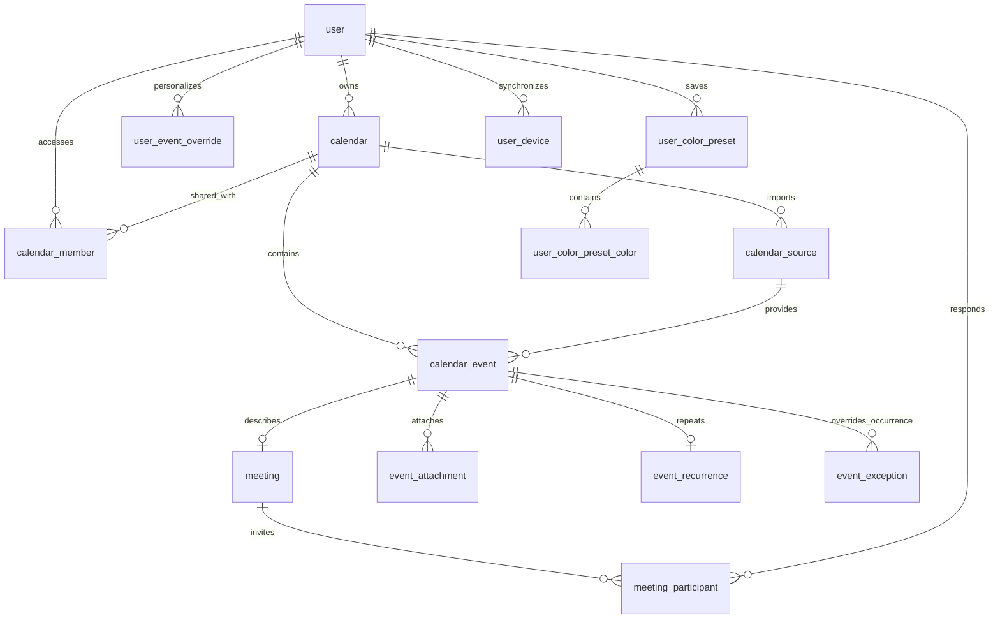

# Triton42 adatbázis

A séma a meglévő PostgreSQL/Drizzle/Better Auth alapot bővíti. A `0001` migráció
31 új táblát hoz létre, a `0002` automatikus verziózást és tranzakciós
változásnaplót telepít. A meglévő auth- és fizetési adatok megmaradnak.

Az adatbázishoz már elkészültek a hitelesített API-k, jogosultságvizsgálatok,
fájlfeltöltés, meghívókezelés és szerveroldali szinkronizáció. A `0003` migráció
fagyasztott szinkronpillanatképeket és kézbesített kurzorpozíciót ad hozzá.
A részletes szerződés: [Calendar API](calendar-api.md). A kliensoldali bekötés,
értesítésküldés és a mostani SQLite-adatok automatikus felküldése még nincs kész.

## Kapcsolatok

## Táblák és adatgazdák

| Terület                      | Táblák                                                                                        | Adatgazda / láthatóság                                                         |
| ---------------------------- | --------------------------------------------------------------------------------------------- | ------------------------------------------------------------------------------ |
| Belépés                      | `user`, `account`, `session`, `verification`                                                  | Meglévő Better Auth; a jelszó hash az accountban marad                         |
| Naptárak                     | `calendar`, `calendar_member`, `calendar_invitation`                                          | Tulajdonos; reader/editor/busy_only tagság; meghívóhash és lejárat             |
| Összehasonlítás              | `schedule_profile`, `schedule_profile_calendar`                                               | Személyes profilok; nem feltétlenül regisztrált userek                         |
| Import                       | `calendar_source`, `calendar_source_revision`                                                 | Naptárhoz kapcsolt forrás, lefedettség, tárolt importverziók                   |
| Forráskapcsolat              | `calendar_source_connection`                                                                  | Privát import URL és frissítési állapot, csak a tulajdonos számára             |
| Események                    | `calendar_event`, `event_recurrence`, `event_exception`                                       | Közös cím, jegyzet, helyszín, szín, foglaltság, ismétlődés és alkalomkivételek |
| Csatolmányok                 | `event_attachment`                                                                            | Közös fájlok és HTTP(S) linkek; minden eseménytípushoz használható             |
| Találkozók                   | `meeting`, `meeting_participant`                                                              | Közös eseményre hivatkozó szervezés és userenkénti RSVP                        |
| Személyes eseményszerkesztés | `user_event_override`                                                                         | Privát cím, jegyzet, helyszín, időpontfelülírás és elrejtés                    |
| Színek                       | `user_color_preset`, `user_color_preset_color`, `user_color_rule`, `user_calendar_preference` | Privát presetek, szabályok, sorrend és láthatóság                              |
| Feladat és jegyzetlink       | `user_task`, `user_notebook_link`                                                             | Személyes adatok; közös link az event_attachmentbe kerül                       |
| Emlékeztetők                 | `user_reminder_setting`, `user_reminder_rule`, `user_event_reminder_setting`                  | Privát globális és esemény-/alkalomfüggő szabályok                             |
| Beállítások                  | `user_preference`, `user_device`, `user_device_preference`                                    | Userenkénti vagy eszközönkénti beállítások                                     |
| Szinkron                     | `sync_change`, `sync_cursor`, `sync_mutation`                                                 | Változásnapló, eszközkurzor, idempotens kliensműveletek                        |
| Helyi adatimport             | `legacy_import_mapping`                                                                       | Eszköz és helyi azonosító → szerverazonosító                                   |

Egy meetingnek nincs második title/notes/color mezője: az `event_id`-val
hivatkozott eseményben tároljuk ezeket. Résztvevőként ugyanaz az esemény jelenik
meg a saját nézetben, nem külön másolat. A meghívás nem ad hozzáférést a szervező
más eseményeihez vagy teljes naptárához.

A felhasználói és eszközazonosítók összetett idegen kulcsai megakadályozzák,
hogy más user eszközére, profiljára vagy színpresetjére hivatkozzanak személyes
rekordok. Ez strukturális integritás, nem az API-jogosultságellenőrzés helyettesítője.

## Események, időpontok, import

- Az új domainrekordok text ID-t kapnak, alapértelmezetten UUID-val. A kliens
  offline is előállíthat UUID-t. A Better Auth meglévő azonosítóformátuma megmarad.
- Timed eseménynél starts_at/ends_at timestamptz és IANA-időzóna szerepel.
  All-day eseménynél start_date/end_date date; a záródátum kizáró.
- A RRULE érték szemantikai validálása és az időzónák ellenőrzése a későbbi
  import/API feladata. Az A/B hetekhez referenciadátum és referenciahét tartozik.
- Az external_uid forráson belül egyedi, újraimportáláskor ugyanaz az event ID
  marad. Az occurrence_key az eredeti alkalomazonosító, időpontmozgatáskor is.
- A calendar_source_revision.is_current forrásonként legfeljebb egy aktív revíziót
  enged. Publikáláskor az előző aktuális jelző és az új revízió ugyanabban a
  tranzakcióban cserélendő. Hibás frissítéskor a korábbi adatok megmaradnak.
- A kibontott alkalmak, keresőindexek és szabadidő-intervallumok újraszámíthatók;
  nem önálló központi adatforrások. Ismeretlen importlefedettség nem szabad idő.
- Személyes időpontfelülírás nem változtatja meg a közös találkozó időpontját.

## Csatolmányok és színek

File csatolmány: privát objektumtárolási kulcs, MIME-típus, méret, opcionális hash.
Link csatolmány: HTTP(S) URL. Egy rekord nem lehet egyszerre file és link.
A fájlbyte-ok nem PostgreSQL-be kerülnek. A storage_key nem publikus letöltési URL.
A későbbi letöltési API minden kérésnél jogosultságot ellenőriz és rövid élettartamú
hozzáférést ad; a meglévő publikus fájlútvonalat nem szabad ehhez automatikusan
használni. A feltöltési ellenőrzés, vírusellenőrzés és tárhelytakarítás külön munka.
Az occurrence_key üresen az egész eseményre, kitöltve egy alkalomra kapcsol.

A színek #RRGGBB értékként tárolódnak; a picker felülete nincs implementálva.
A témafüggő kontrasztjavítás származtatott megjelenítési érték. light_color és
dark_color csak explicit személyes felülírás. A színszabály target_key-je stabil
kulcs: defaultnál kategória (lesson/deadline), seriesnél normalizált tantárgy+
csoportazonosító, más scope-nál a célazonosító. A zöld/sárga/piros küszöbök percben
vannak. A privát színszabály nem írja át a közös calendar_event.color értéket.

## Szinkronizációs szerződés a későbbi backend számára

1. A domainrekordok id, created_at, updated_at, version, deleted_at mezőket kapnak.
   A trigger INSERT-nél version=1-et, UPDATE-nél old.version+1-et állít be.
   Az updated_at szerveridő. A rekordazonosító és a naplózási scope nem mozgatható.
2. Minden domainmódosítás és törlés ugyanabban a tranzakcióban sync_change sort
   ír. A napló csak azonosítót, verziót, műveletet és hozzáférési scope-ot tartalmaz,
   nem eseményszöveget, fájlt, jelszót vagy import URL-t.
3. Privát adatok scope-ja user_id. Közös eseményeké event_id és calendar_id:
   így a naptártagok és a csak adott meetingre meghívott userek is lekérhetik
   a hozzájuk tartozó változásokat. A meeting-participant és calendar-member
   naplóbejegyzés affected_user_id-ja megőrzi a visszavont hozzáférés címzettjét is.
4. A feedet a bejelentkezett user alapján kell szűrni. A közös event/calendar
   scope-ot aktuális, nem törölt szülőkkel és tagságokkal kell feloldani.
   A busy_only user kizárólag foglaltsági projekciót kap; cím, jegyzet, szín,
   link, csatolmány, importforrás és meghívottlista nem kerül a válaszába.
   Meghívott a meeting eseményét és közös csatolmányait láthatja, nem annak forrását.
5. A napló nem jogosultsági engedély. Minden rekord- és fájlolvasás, illetve írás
   külön ellenőrzést igényel. Az érintett címzettnek szánt revocation üzenet
   csak helyi törlést jelenthet, új hozzáférést nem. Jogosultságcsökkentés is purge
   és új projekció; új megosztáskor scoped snapshot szükséges a régi adatokhoz.
6. Írás: UPDATE ... WHERE id=? AND version=? RETURNING ...; nulla sor konfliktus.
   A kliens nem írhatja felül feltétel nélkül a másik eszköz változtatását.
   A sync_mutation rekord és a domainírás közös tranzakcióban történik;
   ismételt client_mutation_id-nál a request_hash egyezését ellenőrizni kell.
7. A kliens SQLite outboxból küldi az offline változásokat. Csak tartós helyi
   feldolgozás után halad a sync_cursor. A bigint pozíció JSON-ban string legyen.
   A kliens a szerver rekordverzióját is őrizze.
8. Soft delete ajánlott. Szülő törlésekor a kliens a lokális részfát és
   hozzátartozó jogosultságokat eltávolítja. A fizikai cascade utáni változásnapló
   szándékosan nem FK-val hivatkozik a törölt rekordokra. Régi napló/tombstone
   takarítása előtt a lemaradt eszközöket requires_full_sync=true-val jelölni kell.
9. Egy tranzakciószintű advisory lock sorosítja a domainírásokat még a statement
   sorzárai előtt. Így a sequence nem előzi meg egy később commitoló tranzakció
   láthatóvá válását. Ez kezdeti terhelésre egyszerű, tudatos kompromisszum;
   nagy írási terhelésnél külön commit-biztos feed architektúrára cserélendő.
   Domainírást végző tranzakció ne fogjon előbb auth/user sorzárat: a lock legyen
   az első a tranzakcióban, ha auth-adatot is módosít. TRUNCATE nem szinkronművelet.

## Beállítások és helyi adatok átemelése

A theme=system választás szinkronizálódik; a tényleges rendszer-témát az eszköz
állapítja meg. Panelek, zoom, görgetés és megnyitott nézetek eszközfüggők.
A mai napra indulás alapbeállítás, az aktuális dátum nincs központilag tárolva.
Az értesítési szabályok useradatok, az OS engedélye és ütemezett értesítési ID
helyi adat. A battery tájékoztató állapota eszközfüggő; az OS tényleges állapotát
mindig helyben kell ellenőrizni. Quick-action konfiguráció előkészítve,
platformfunkció nincs implementálva.

A későbbi SQLite-átemelés a legacy_import_mapping táblát használja azonosítókhoz.
Első eszközön a profilok/naptárak/források/események után jönnek a felülírások,
feladatok, linkek, színek és emlékeztetők. Második eszközön forrásazonosság és
ICS UID alapján egyeztetni kell; az eszközönkénti mapping önmagában nem szünteti
meg a több eszközről behozott azonos naptár duplikációját. A helyi DB nem törölhető
sikeres, ellenőrzött átemelés előtt.

## Migráció és ellenőrzés

Használd a verziózott `db:migrate` folyamatot, ne db:push-t: a custom SQL triggereket
csak a migráció telepíti. Alkalmazás előtt készüljön backup. A normalizált email
és provider/account egyediség meglévő duplikátum esetén tranzakciósan megállítja
a migrációt; nem töröl és nem von össze felhasználókat.

A backend build után a meglévő `backend/test/integration/database.mjs` futtatja
az új calendar-schema ellenőrzéseket is. TEST_DATABASE_URL kötelezően elkülönített,
`_test` végű, üres adatbázist jelöljön. Az ellenőrzések valódi PostgreSQL-en
vizsgálják a migrációt, adatkorlátokat, személyes scope-okat, meeting-változásokat,
verzióütközést, rollbacket, párhuzamos írást és szülőtörlést.
